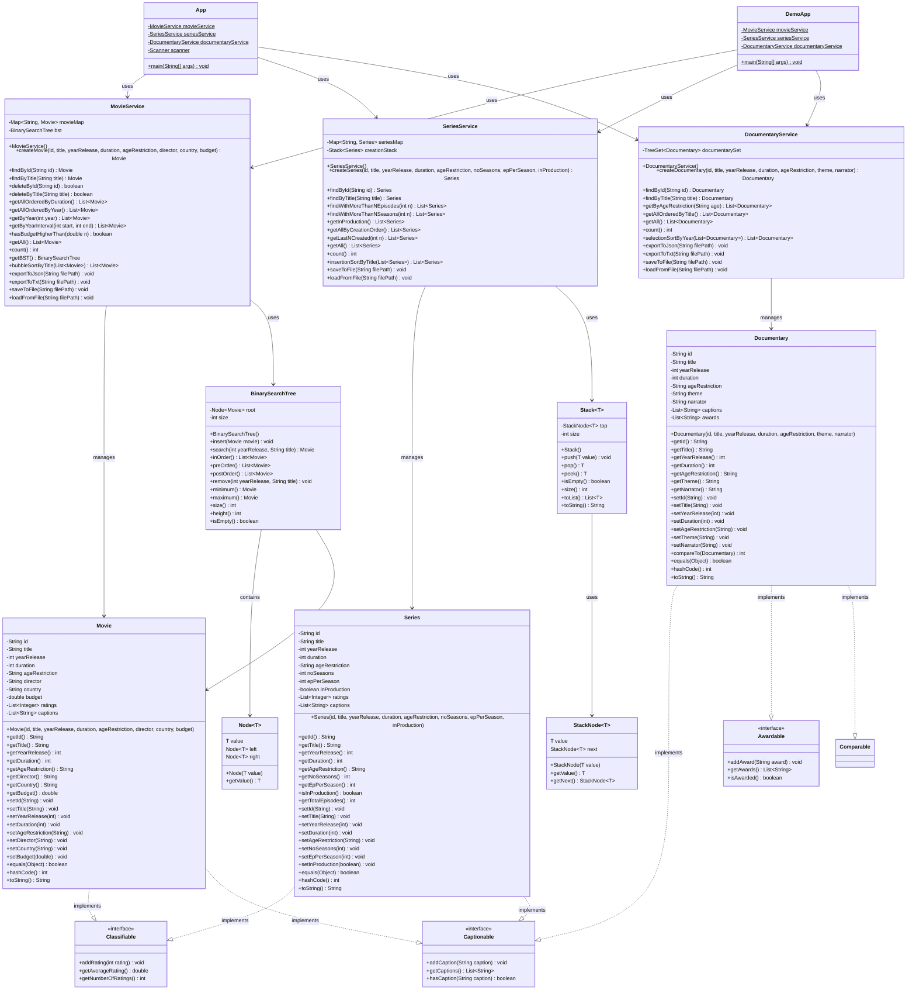

# Class Diagram — Streaming Content Management Platform

```mermaid
classDiagram

%% ─────────────────────────────────────────
%% INTERFACES
%% ─────────────────────────────────────────

class Classifiable {
    <<interface>>
    +addRating(int rating) void
    +getAverageRating() double
    +getNumberOfRatings() int
}

class Captionable {
    <<interface>>
    +addCaption(String caption) void
    +getCaptions() List~String~
    +hasCaption(String caption) boolean
}

class Awardable {
    <<interface>>
    +addAward(String award) void
    +getAwards() List~String~
    +isAwarded() boolean
}

%% ─────────────────────────────────────────
%% MODELS
%% ─────────────────────────────────────────

class Movie {
    -String id
    -String title
    -int yearRelease
    -int duration
    -String ageRestriction
    -String director
    -String country
    -double budget
    -List~Integer~ ratings
    -List~String~ captions
    +Movie(id, title, yearRelease, duration, ageRestriction, director, country, budget)
    +getId() String
    +getTitle() String
    +getYearRelease() int
    +getDuration() int
    +getAgeRestriction() String
    +getDirector() String
    +getCountry() String
    +getBudget() double
    +setId(String) void
    +setTitle(String) void
    +setYearRelease(int) void
    +setDuration(int) void
    +setAgeRestriction(String) void
    +setDirector(String) void
    +setCountry(String) void
    +setBudget(double) void
    +equals(Object) boolean
    +hashCode() int
    +toString() String
}

class Series {
    -String id
    -String title
    -int yearRelease
    -int duration
    -String ageRestriction
    -int noSeasons
    -int epPerSeason
    -boolean inProduction
    -List~Integer~ ratings
    -List~String~ captions
    +Series(id, title, yearRelease, duration, ageRestriction, noSeasons, epPerSeason, inProduction)
    +getId() String
    +getTitle() String
    +getYearRelease() int
    +getDuration() int
    +getAgeRestriction() String
    +getNoSeasons() int
    +getEpPerSeason() int
    +isInProduction() boolean
    +getTotalEpisodes() int
    +setId(String) void
    +setTitle(String) void
    +setYearRelease(int) void
    +setDuration(int) void
    +setAgeRestriction(String) void
    +setNoSeasons(int) void
    +setEpPerSeason(int) void
    +setInProduction(boolean) void
    +equals(Object) boolean
    +hashCode() int
    +toString() String
}

class Documentary {
    -String id
    -String title
    -int yearRelease
    -int duration
    -String ageRestriction
    -String theme
    -String narrator
    -List~String~ captions
    -List~String~ awards
    +Documentary(id, title, yearRelease, duration, ageRestriction, theme, narrator)
    +getId() String
    +getTitle() String
    +getYearRelease() int
    +getDuration() int
    +getAgeRestriction() String
    +getTheme() String
    +getNarrator() String
    +setId(String) void
    +setTitle(String) void
    +setYearRelease(int) void
    +setDuration(int) void
    +setAgeRestriction(String) void
    +setTheme(String) void
    +setNarrator(String) void
    +compareTo(Documentary) int
    +equals(Object) boolean
    +hashCode() int
    +toString() String
}

%% ─────────────────────────────────────────
%% UTILITIES
%% ─────────────────────────────────────────

class StackNode~T~ {
    T value
    StackNode~T~ next
    +StackNode(T value)
    +getValue() T
    +getNext() StackNode~T~
}

class Stack~T~ {
    -StackNode~T~ top
    -int size
    +Stack()
    +push(T value) void
    +pop() T
    +peek() T
    +isEmpty() boolean
    +size() int
    +toList() List~T~
    +toString() String
}

%% ─────────────────────────────────────────
%% TREE
%% ─────────────────────────────────────────

class Node~T~ {
    T value
    Node~T~ left
    Node~T~ right
    +Node(T value)
    +getValue() T
}

class BinarySearchTree {
    -Node~Movie~ root
    -int size
    +BinarySearchTree()
    +insert(Movie movie) void
    +search(int yearRelease, String title) Movie
    +inOrder() List~Movie~
    +preOrder() List~Movie~
    +postOrder() List~Movie~
    +remove(int yearRelease, String title) void
    +minimum() Movie
    +maximum() Movie
    +size() int
    +height() int
    +isEmpty() boolean
}

%% ─────────────────────────────────────────
%% SERVICES
%% ─────────────────────────────────────────

class MovieService {
    -Map~String, Movie~ movieMap
    -BinarySearchTree bst
    +MovieService()
    +createMovie(id, title, yearRelease, duration, ageRestriction, director, country, budget) Movie
    +findById(String id) Movie
    +findByTitle(String title) Movie
    +deleteById(String id) boolean
    +deleteByTitle(String title) boolean
    +getAllOrderedByDuration() List~Movie~
    +getAllOrderedByYear() List~Movie~
    +getByYear(int year) List~Movie~
    +getByYearInterval(int start, int end) List~Movie~
    +hasBudgetHigherThan(double n) boolean
    +getAll() List~Movie~
    +count() int
    +getBST() BinarySearchTree
    +bubbleSortByTitle(List~Movie~) List~Movie~
    +exportToJson(String filePath) void
    +exportToTxt(String filePath) void
    +saveToFile(String filePath) void
    +loadFromFile(String filePath) void
}

class SeriesService {
    -Map~String, Series~ seriesMap
    -Stack~Series~ creationStack
    +SeriesService()
    +createSeries(id, title, yearRelease, duration, ageRestriction, noSeasons, epPerSeason, inProduction) Series
    +findById(String id) Series
    +findByTitle(String title) Series
    +findWithMoreThanNEpisodes(int n) List~Series~
    +findWithMoreThanNSeasons(int n) List~Series~
    +getInProduction() List~Series~
    +getAllByCreationOrder() List~Series~
    +getLastNCreated(int n) List~Series~
    +getAll() List~Series~
    +count() int
    +insertionSortByTitle(List~Series~) List~Series~
    +saveToFile(String filePath) void
    +loadFromFile(String filePath) void
}

class DocumentaryService {
    -TreeSet~Documentary~ documentarySet
    +DocumentaryService()
    +createDocumentary(id, title, yearRelease, duration, ageRestriction, theme, narrator) Documentary
    +findById(String id) Documentary
    +findByTitle(String title) Documentary
    +getByAgeRestriction(String age) List~Documentary~
    +getAllOrderedByTitle() List~Documentary~
    +getAll() List~Documentary~
    +count() int
    +selectionSortByYear(List~Documentary~) List~Documentary~
    +exportToJson(String filePath) void
    +exportToTxt(String filePath) void
    +saveToFile(String filePath) void
    +loadFromFile(String filePath) void
}

%% ─────────────────────────────────────────
%% APP
%% ─────────────────────────────────────────

class App {
    -MovieService movieService$
    -SeriesService seriesService$
    -DocumentaryService documentaryService$
    -Scanner scanner$
    +main(String[] args)$ void
}

class DemoApp {
    -MovieService movieService$
    -SeriesService seriesService$
    -DocumentaryService documentaryService$
    +main(String[] args)$ void
}

%% ─────────────────────────────────────────
%% RELATIONSHIPS — Interfaces
%% ─────────────────────────────────────────

Movie ..|> Classifiable : implements
Movie ..|> Captionable : implements
Series ..|> Classifiable : implements
Series ..|> Captionable : implements
Documentary ..|> Captionable : implements
Documentary ..|> Awardable : implements
Documentary ..|> Comparable : implements

%% ─────────────────────────────────────────
%% RELATIONSHIPS — Utilities
%% ─────────────────────────────────────────

Stack~T~ --> StackNode~T~ : uses

%% ─────────────────────────────────────────
%% RELATIONSHIPS — Tree
%% ─────────────────────────────────────────

BinarySearchTree --> Node~T~ : contains
BinarySearchTree --> Movie : stores

%% ─────────────────────────────────────────
%% RELATIONSHIPS — Services → Models
%% ─────────────────────────────────────────

MovieService --> Movie : manages
MovieService --> BinarySearchTree : uses
SeriesService --> Series : manages
SeriesService --> Stack~T~ : uses
DocumentaryService --> Documentary : manages

%% ─────────────────────────────────────────
%% RELATIONSHIPS — App → Services
%% ─────────────────────────────────────────

App --> MovieService : uses
App --> SeriesService : uses
App --> DocumentaryService : uses
DemoApp --> MovieService : uses
DemoApp --> SeriesService : uses
DemoApp --> DocumentaryService : uses
```
