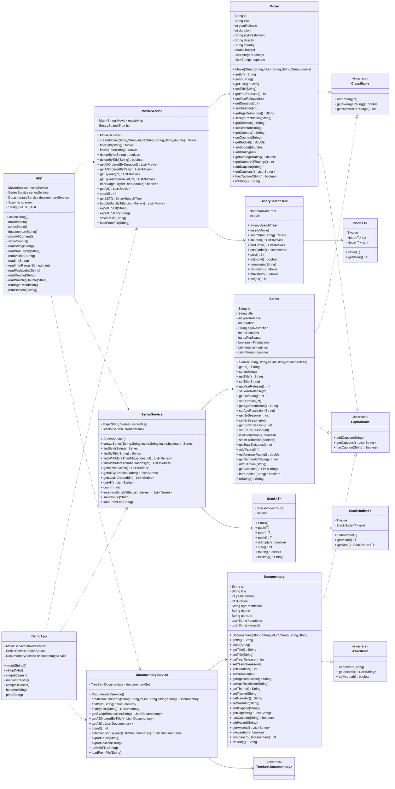

# Class Diagram (Streaming-Management)

Diagrama em Mermaid com classes, interfaces, atributos/metodos principais e relacoes.

```mermaid
classDiagram
    direction LR

    %% ======== App ========
    class App {
        - MovieService movieService
        - SeriesService seriesService
        - DocumentaryService documentaryService
        - Scanner scanner
        - String[] VALID_AGE
        + main(String[])
        - movieMenu()
        - seriesMenu()
        - documentaryMenu()
        - showAllContent()
        - showCounts()
        - readString(String)
        - readNonEmpty(String)
        - readValidId(String)
        - readInt(String)
        - readIntInRange(String,int,int)
        - readPositiveInt(String)
        - readDouble(String)
        - readNonNegDouble(String)
        - readAgeRestriction()
        - readBoolean(String)
    }

    class DemoApp {
        - MovieService movieService
        - SeriesService seriesService
        - DocumentaryService documentaryService
        + main(String[])
        - setupData()
        - simpleCases()
        - mediumCases()
        - complexCases()
        - header(String)
        - print(String)
    }

    %% ======== Interfaces ========
    class Awardable <<interface>> {
        + addAward(String)
        + getAwards() List~String~
        + isAwarded() boolean
    }

    class Captionable <<interface>> {
        + addCaption(String)
        + getCaptions() List~String~
        + hasCaption(String) boolean
    }

    class Classifiable <<interface>> {
        + addRating(int)
        + getAverageRating() double
        + getNumberOfRatings() int
    }

    %% ======== Models ========
    class Movie {
        - String id
        - String title
        - int yearRelease
        - int duration
        - String ageRestriction
        - String director
        - String country
        - double budget
        - List~Integer~ ratings
        - List~String~ captions
        + Movie(String,String,int,int,String,String,String,double)
        + getId() String
        + setId(String)
        + getTitle() String
        + setTitle(String)
        + getYearRelease() int
        + setYearRelease(int)
        + getDuration() int
        + setDuration(int)
        + getAgeRestriction() String
        + setAgeRestriction(String)
        + getDirector() String
        + setDirector(String)
        + getCountry() String
        + setCountry(String)
        + getBudget() double
        + setBudget(double)
        + addRating(int)
        + getAverageRating() double
        + getNumberOfRatings() int
        + addCaption(String)
        + getCaptions() List~String~
        + hasCaption(String) boolean
        + toString() String
    }

    class Series {
        - String id
        - String title
        - int yearRelease
        - int duration
        - String ageRestriction
        - int noSeasons
        - int epPerSeason
        - boolean inProduction
        - List~Integer~ ratings
        - List~String~ captions
        + Series(String,String,int,int,String,int,int,boolean)
        + getId() String
        + setId(String)
        + getTitle() String
        + setTitle(String)
        + getYearRelease() int
        + setYearRelease(int)
        + getDuration() int
        + setDuration(int)
        + getAgeRestriction() String
        + setAgeRestriction(String)
        + getNoSeasons() int
        + setNoSeasons(int)
        + getEpPerSeason() int
        + setEpPerSeason(int)
        + isInProduction() boolean
        + setInProduction(boolean)
        + getTotalEpisodes() int
        + addRating(int)
        + getAverageRating() double
        + getNumberOfRatings() int
        + addCaption(String)
        + getCaptions() List~String~
        + hasCaption(String) boolean
        + toString() String
    }

    class Documentary {
        - String id
        - String title
        - int yearRelease
        - int duration
        - String ageRestriction
        - String theme
        - String narrator
        - List~String~ captions
        - List~String~ awards
        + Documentary(String,String,int,int,String,String,String)
        + getId() String
        + setId(String)
        + getTitle() String
        + setTitle(String)
        + getYearRelease() int
        + setYearRelease(int)
        + getDuration() int
        + setDuration(int)
        + getAgeRestriction() String
        + setAgeRestriction(String)
        + getTheme() String
        + setTheme(String)
        + getNarrator() String
        + setNarrator(String)
        + addCaption(String)
        + getCaptions() List~String~
        + hasCaption(String) boolean
        + addAward(String)
        + getAwards() List~String~
        + isAwarded() boolean
        + compareTo(Documentary) int
        + toString() String
    }

    %% ======== Services ========
    class MovieService {
        - Map~String,Movie~ movieMap
        - BinarySearchTree bst
        + MovieService()
        + createMovie(String,String,int,int,String,String,String,double) Movie
        + findById(String) Movie
        + findByTitle(String) Movie
        + deleteById(String) boolean
        + deleteByTitle(String) boolean
        + getAllOrderedByDuration() List~Movie~
        + getAllOrderedByYear() List~Movie~
        + getByYear(int) List~Movie~
        + getByYearInterval(int,int) List~Movie~
        + hasBudgetHigherThan(double) boolean
        + getAll() List~Movie~
        + count() int
        + getBST() BinarySearchTree
        + bubbleSortByTitle(List~Movie~) List~Movie~
        + exportToTxt(String)
        + exportToJson(String)
        + saveToFile(String)
        + loadFromFile(String)
    }

    class SeriesService {
        - Map~String,Series~ seriesMap
        - Stack~Series~ creationStack
        + SeriesService()
        + createSeries(String,String,int,int,String,int,int,boolean) Series
        + findById(String) Series
        + findByTitle(String) Series
        + findWithMoreThanNEpisodes(int) List~Series~
        + findWithMoreThanNSeasons(int) List~Series~
        + getInProduction() List~Series~
        + getAllByCreationOrder() List~Series~
        + getLastNCreated(int) List~Series~
        + getAll() List~Series~
        + count() int
        + insertionSortByTitle(List~Series~) List~Series~
        + saveToFile(String)
        + loadFromFile(String)
    }

    class DocumentaryService {
        - TreeSet~Documentary~ documentarySet
        + DocumentaryService()
        + createDocumentary(String,String,int,int,String,String,String) Documentary
        + findById(String) Documentary
        + findByTitle(String) Documentary
        + getByAgeRestriction(String) List~Documentary~
        + getAllOrderedByTitle() List~Documentary~
        + getAll() List~Documentary~
        + count() int
        + selectionSortByYear(List~Documentary~) List~Documentary~
        + exportToTxt(String)
        + exportToJson(String)
        + saveToFile(String)
        + loadFromFile(String)
    }

    %% ======== Data Structures / Utilities ========
    class BinarySearchTree {
        - Node~Movie~ root
        - int size
        + BinarySearchTree()
        + insert(Movie)
        + search(int,String) Movie
        + inOrder() List~Movie~
        + preOrder() List~Movie~
        + postOrder() List~Movie~
        + size() int
        + isEmpty() boolean
        + remove(int,String)
        + minimum() Movie
        + maximum() Movie
        + height() int
    }

    class Node~T~ {
        - T value
        - Node~T~ left
        - Node~T~ right
        + Node(T)
        + getValue() T
    }

    class Stack~T~ {
        - StackNode~T~ top
        - int size
        + Stack()
        + push(T)
        + pop() T
        + peek() T
        + isEmpty() boolean
        + size() int
        + toList() List~T~
        + toString() String
    }

    class StackNode~T~ {
        - T value
        - StackNode~T~ next
        + StackNode(T)
        + getValue() T
        + getNext() StackNode~T~
    }

    %% ======== Relationships ========
    App ..> MovieService
    App ..> SeriesService
    App ..> DocumentaryService

    DemoApp ..> MovieService
    DemoApp ..> SeriesService
    DemoApp ..> DocumentaryService

    MovieService --> Movie
    SeriesService --> Series
    DocumentaryService --> Documentary

    MovieService --> BinarySearchTree
    SeriesService --> Stack~Series~
    DocumentaryService --> TreeSet~Documentary~

    BinarySearchTree --> Node~Movie~
    Stack~T~ --> StackNode~T~

    Movie ..|> Classifiable
    Movie ..|> Captionable

    Series ..|> Classifiable
    Series ..|> Captionable

    Documentary ..|> Captionable
    Documentary ..|> Awardable

    %% External types (JDK)
    class TreeSet~Documentary~ <<external>>
```
